# Bash Scripting Tasks

Данный репозиторий содержит набор заданий по bash-скриптам, выполненных в рамках домашнего задания по теме Работа с оболочкой Bash для решения задач в области инженерии данных в рамках дисциплины Семинар наставника.
Все скрипты размещены в каталоге `hw/`, а результаты их выполнения подтверждены скриншотами в каталоге `screenshots/`.

---

## ✅ Задание 1 — Работа с файлами и каталогами

**Скрипт:** `task1_file_info.sh`

### Описание  
Скрипт выполняет следующие действия:
- выводит список всех объектов в текущей директории с указанием их типа
  (файл, директория, символическая ссылка и т.д.);
- проверяет существование файла, переданного в качестве аргумента скрипту;
- с помощью цикла `for` выводит имя каждого объекта и его права доступа.

### Результат  
Получены навыки работы с файловой системой Linux, циклами и проверками
существования файлов.

### Скриншот  
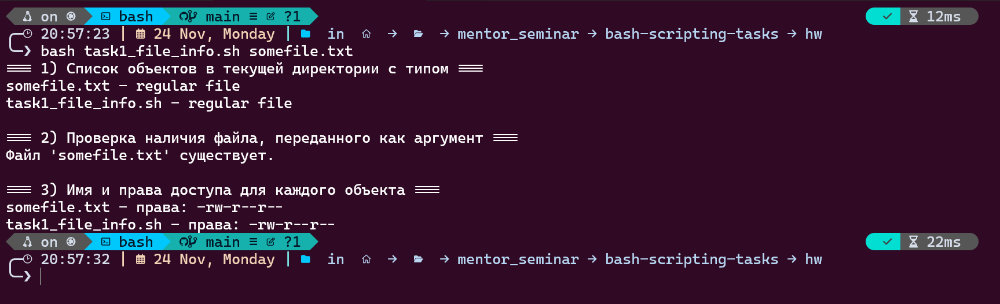

---

## ✅ Задание 2 — Переменная PATH и окружение

**Скрипт:** `task2_path.sh`

### Описание  
Скрипт:
- выводит текущее значение переменной окружения `PATH`;
- принимает директорию в качестве аргумента;
- добавляет указанную директорию во временный `PATH`
  (только на время выполнения текущего процесса).

Изменение `PATH`, выполненное в скрипте, **не сохраняется после закрытия терминала**.

### Пояснение

```text
- Переменная PATH хранится в окружении конкретного процесса (конкретного shell).
- После закрытия терминала процесс shell завершается, и все изменения PATH пропадают.
- Чтобы сделать изменения постоянными, команду вида:

    export PATH="$PATH:/some/new/dir"

  необходимо добавить в файл ~/.bashrc (или ~/.profile — в зависимости от системы).

- После изменения ~/.bashrc можно:
    1) Перезапустить терминал, или
    2) Выполнить команду: source ~/.bashrc

Таким образом, данный скрипт демонстрирует временное изменение окружения, а
постоянная настройка PATH выполняется через конфигурационные файлы shell.
```

### Результат  
Освоена работа с переменными окружения и экспорт переменных в bash.

### Скриншот  
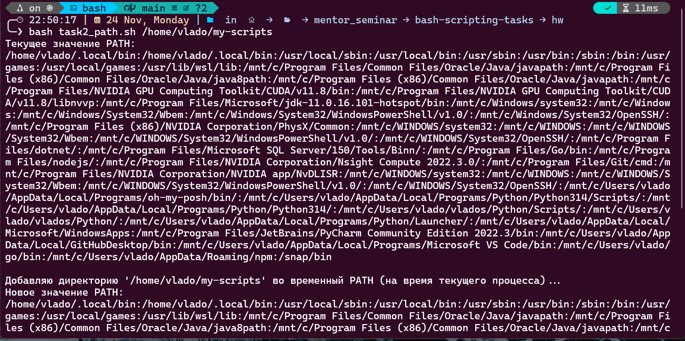
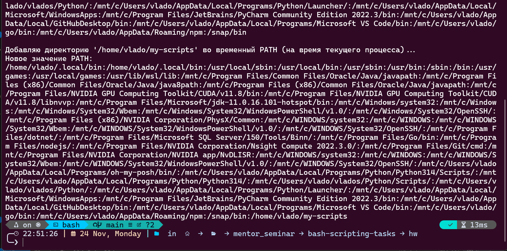

---

## ✅ Задание 3 — Условия и циклы

**Скрипт:** `task3_conditions_loops.sh`

### Описание  
Скрипт:
- запрашивает у пользователя целое число;
- определяет, является ли число положительным, отрицательным или равным нулю;
- при положительном числе выводит все числа от 1 до введённого значения
  с помощью цикла `while`.

### Результат  
Отработано использование условий (`if`, `elif`) и циклов `while`.

### Скриншот  
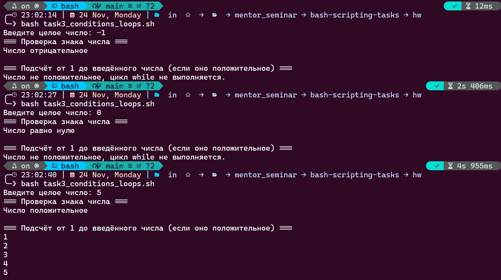

---

## ✅ Задание 4 — Функции в Bash

**Скрипт:** `task4_functions.sh`

### Описание  
В скрипте реализованы функции:
- `say_hello` — принимает имя и выводит приветствие;
- `sum_two_numbers` — принимает два числа и возвращает их сумму.

Скрипт использует аргументы командной строки:
- имя пользователя;
- два числа для вычисления суммы.

### Результат  
Продемонстрирована работа с функциями, аргументами и возвратом значений.

### Скриншот  
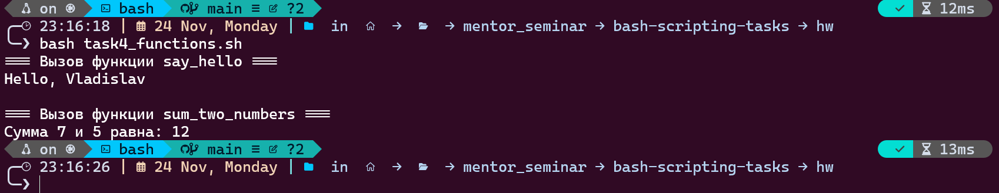

---

## ✅ Задание 5 — Управление фоновыми процессами

**Скрипт:** `task5_jobs.sh`

### Описание  
Скрипт:
- запускает несколько команд `sleep` в фоновом режиме;
- отображает текущие фоновые задачи с помощью `jobs`;
- демонстрирует использование команд `fg` и `bg`.

### Результат  
Освоено управление процессами в интерактивном shell.

### Скриншот  
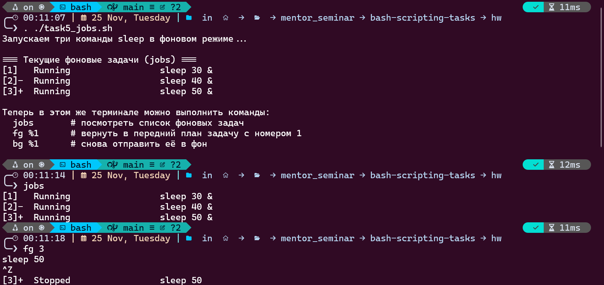
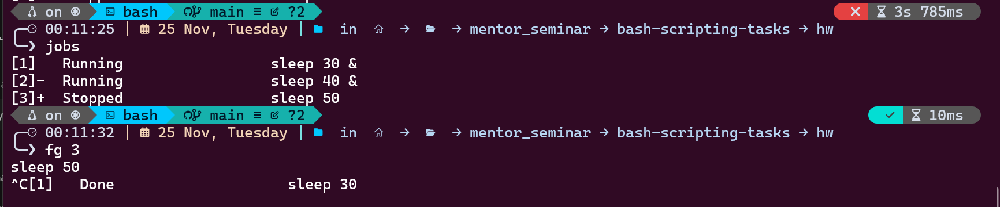

---

## ✅ Задание 6 — Перенаправление потоков ввода и вывода

**Скрипт:** `task6_redirection.sh`

### Описание  
Скрипт:
- проверяет наличие файла `input.txt` и создаёт его при отсутствии;
- считает количество строк и записывает результат в `output.txt`;
- перенаправляет сообщения об ошибках в файл `error.log`.

### Результат  
Отработано перенаправление стандартного вывода и ошибок.

### Скриншот  
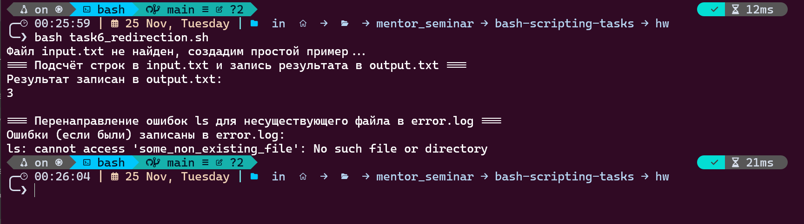

---

## ✅ Задание 7 — Aliases и автодополнение

**Скрипт:** `task7_aliases.sh`

### Описание  
Скрипт содержит пояснения:
- по созданию временных и постоянных alias;
- по добавлению alias в `~/.bashrc`;
- по использованию автодополнения (Tab) в bash.

### Результат  
Освоены alias и возможности командной строки для повышения удобства работы.

### Скриншот  
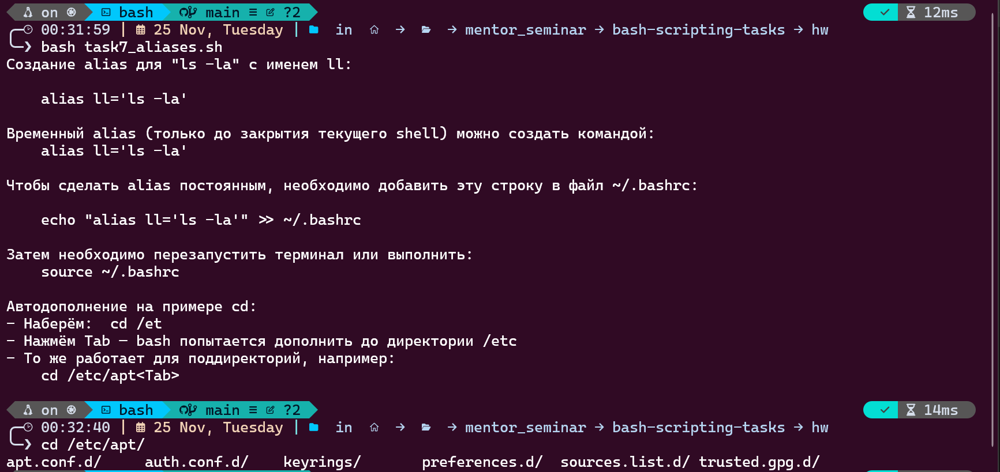

---

## ✅ Задание 8 — Менеджер резервного копирования

**Скрипт:** `task8_backup_manager.sh`

### Описание  
Скрипт:
- создаёт резервные копии файлов в указанной директории;
- добавляет текущую дату к имени каждого файла;
- автоматически создаёт папку для бэкапов;
- ведёт лог всех операций;
- выводит количество успешно скопированных файлов.

### Результат  
Реализован простой и надёжный механизм резервного копирования файлов.

### Скриншоты  
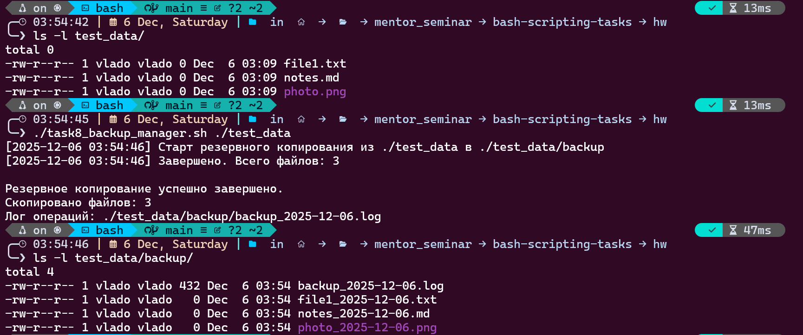  
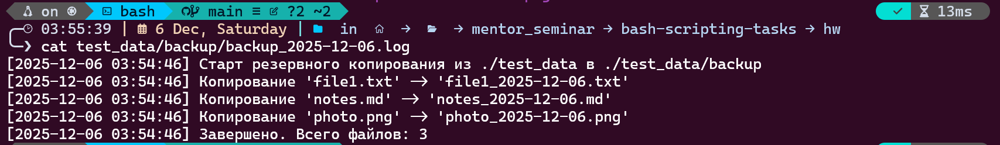

---

## ✅ Задание 9 — Мониторинг системных ресурсов

**Скрипт:** `task9_system_monitor.sh`

### Описание  
Скрипт:
- выводит загрузку процессора;
- показывает использование оперативной памяти;
- отображает занятость диска;
- уведомляет пользователя, если потребление памяти превышает заданный порог.

### Результат  
Реализован базовый мониторинг состояния системы.

### Скриншот  
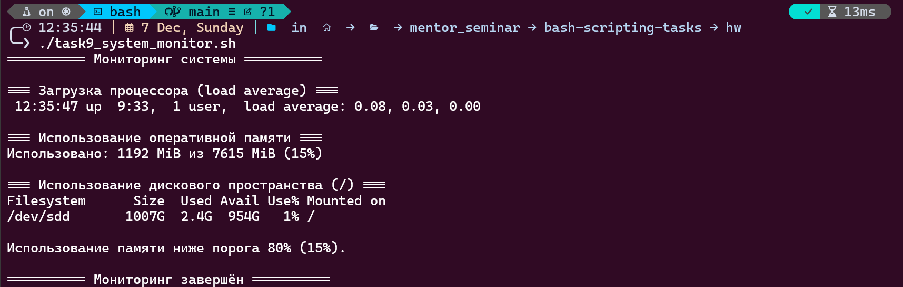

---

## ✅ Задание 10 — Автоматическая сортировка файлов

**Скрипт:** `task10_file_sorter.sh`

### Описание  
Скрипт:
- автоматически сортирует файлы в указанной директории;
- изображения (`.jpg`, `.png`, `.gif`) перемещает в папку `Images`;
- документы (`.txt`, `.pdf`, `.docx`) — в папку `Documents`;
- создаёт необходимые папки при отсутствии;
- ведёт лог всех перемещений файлов;
- может быть запущен автоматически через `cron`.

### Результат  
Файлы корректно сортируются по типам, все действия фиксируются в лог-файле.

### Скриншоты  
  

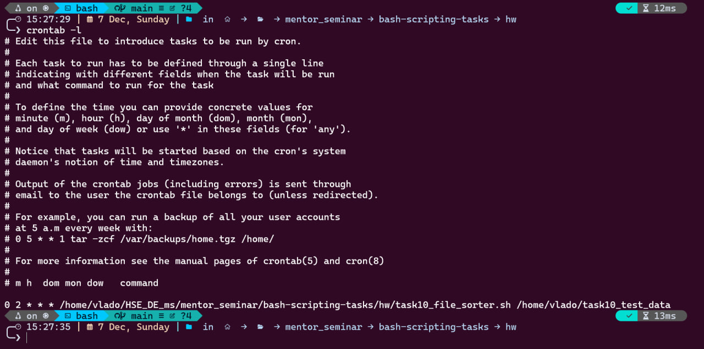

---

## 📁 Структура репозитория

```text
bash-scripting-tasks/
├── hw/              # bash-скрипты заданий
├── screenshots/     # скриншоты выполнения заданий
├── README.md
